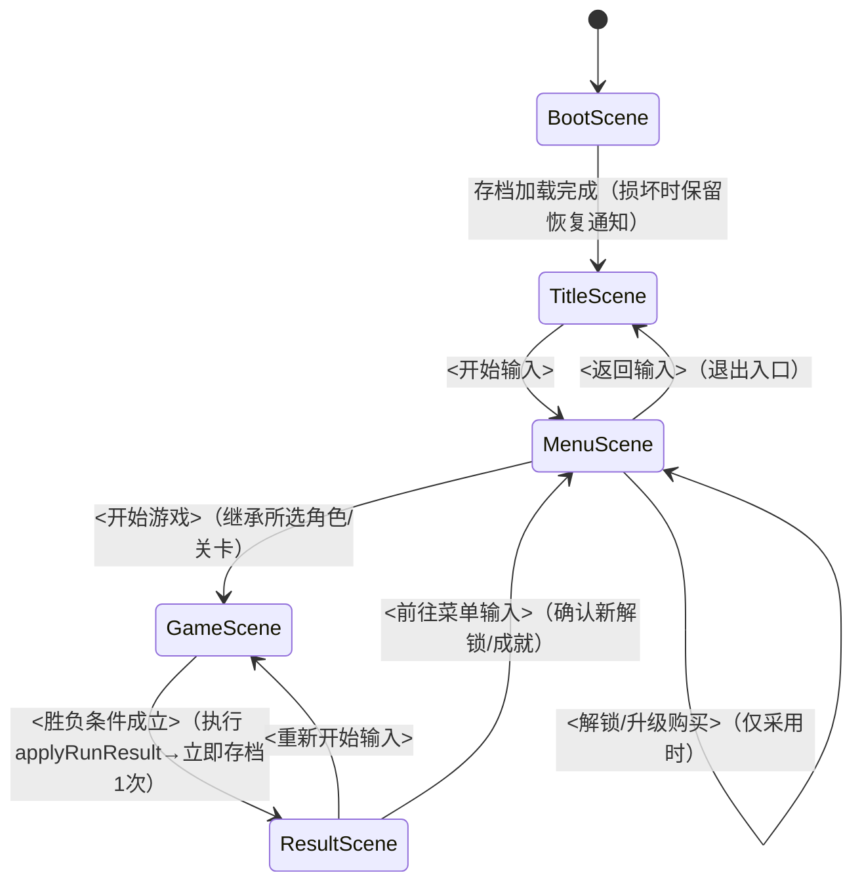

<!--
  模板: design/gdd.md（输出位置固定为 contract.md §6 的此路径）
  producer: game-designer / reviewer: design-reviewer（Gate: DR-GDD, MAX_ITER 3）
  角色: 实现的规格书。分解到 stories.yaml 的依据，以及按引擎区分的 config 权威来源
  （phaser: game/src/config.ts / unity: GameConfig.cs / unreal: GameConfig.h — contract §11）中数值的权威来源
  撰写规则: 采用直接回应 DR-GDD 的6要点（concept一致性 / 可实现性 / 数值的具体性 / 完备性 / 矛盾扫描 /
  游戏外完备性）的结构。全部系统必须引用 P-xx。数值禁止「以后再定」＝以初始值＋调整范围书写。
  必需场景集合 Boot/Title/Menu/Game/Result 与元进度节不可省略（contract §11）。
  可实现性的基准是所选引擎的 tech-stack 文档（state/engine.txt）。
  完成时删除全部指引注释。
-->

# GDD — <游戏标题>

## 系统一览

<!-- 列举构成核心循环的系统。每行必须附 1 个以上 P-xx
     （对任何支柱都无贡献的系统会在 DR-GDD 中被提议删除）。
     概要为可读出「输入→处理→输出」的 1～2 句。
     以 Phaser 3 + TS 超出数小时粒度的系统要拆分或移到 out。 -->

| 系统 | P-xx | 概要 | 实现位置的参考（systems/） |
|---|---|---|---|
| | | | |

## 游戏流程

<!-- 必需场景集合为 Boot/Title/Menu/Game/Result 的5状态（contract §11。不可省略）。名称按引擎区分:
     phaser = BootScene/TitleScene/MenuScene/GameScene/ResultScene（tech-stack.md）
     unity = Boot/Title/Menu/Game/Result 的5场景（tech-stack-unity.md）
     unreal = 以 Maps/ 的关卡或状态迁移实现5状态（tech-stack-unreal.md。不可省略）
     正规流程: Boot→Title→Menu→Game→Result→{Game|Menu}。
     Menu 的必需要素: 开始游戏 / 游戏外显示（解锁、成就、统计）/ 设置（音量、操作说明）/ 退出入口。
     明确写出各迁移的触发（按键输入/条件成立）。推荐 mermaid 状态迁移图（以下为 phaser 写法的示例）。 -->

### Menu 必需要素检查（contract §11。4要素的迁移/显示须全部实际存在于上图与实现中）

| 必需要素 | 对应的迁移/显示（与上方 mermaid、实现一致） |
|---|---|
| 开始游戏 | |
| 游戏外显示（解锁/成就/统计） | |
| 设置（音量、操作说明。音量须接线到实际音频输出并持久化到存档 — 仅显示不可） | |
| 退出入口 | |

## 操作规格

<!-- 把 brief.md 的操作落到规格层级。写到区分按下/长按/松开的瞬间、
     同时输入时的优先顺序。前提是输入集中到1个模块（tech-stack.md 规范4）。 -->

| 输入 | 动作 | 补充（长按/连按/优先级） |
|---|---|---|
| | | |

## 敌人与障碍物

<!-- 按类型: 外观的角色（与 assets.md 的资产 id 对应）、行为模式、
     碰撞判定、出现条件。无尽型则出现表（时间段×出现率）也写在此处。 -->

| 类型 | 行为模式 | 碰到时 | 出现条件 | 对应资产 id |
|---|---|---|---|---|
| | | | | |

## 分数与进度

<!-- 做什么会得分（行为→分值），若有倍率、连击则写其公式，
     定义单局内进度（距离/波次/等级）的单位。公式可用伪代码书写。 -->

## 难度曲线

<!-- 以阶段表写出随时间推移（或分数/距离）什么如何变化。
     自查是否设计成在 brief.md 的单局时长（例: 2～3 分钟）内迎来高潮。 -->

| 经过（时间/距离/分数） | 变化的参数 | 值的变化 |
|---|---|---|
| | | |

## 数值表

<!-- 全部游戏参数的权威来源。实现时此表直接成为按引擎区分的 config
     （phaser: src/config.ts / unity: GameConfig.cs / unreal: GameConfig.h）的
     命名常量（各 tech-stack 规范1: 禁止魔法数字）。
     - 常量名: SCREAMING_SNAKE_CASE 的英文（向引擎侧惯用法的映射由实现者完成）
     - 初始值: 带单位（phaser: px/s 等 / unity: m/s 等 / unreal: cm/s 等）
     - 调整范围: 试玩测试中可以调动的下限～上限。「以后再定」在 DR-GDD 中不合格
     - 依据: 为何是此值，1个短句（例: 「横穿画面约2秒」） -->

| 常量名 | 含义 | 初始值 | 调整范围 | 依据 |
|---|---|---|---|---|
| | | | | |

## 胜负条件

<!-- 胜利条件、失败条件写到判定式层级（例: 「HP <= 0 时失败」「通关 WAVE_MAX 时胜利」）。
     无尽型明示「仅有失败、记录最高分」。判定瞬间的演出与迁移目标也各写1句。 -->

## 重新开始

<!-- 列举从结果画面再挑战的步骤（1次输入即可回到 GameScene），以及
     被重置的状态/继承的状态（最高分等）。
     无法重新开始、状态泄漏按 QA-PLAY 的重大 bug 处理。 -->

## 元进度（游戏外）

<!-- 必需节（由 DR-GDD 要点6 判定。省略、空白不合格）。
     必需: 最高分/最佳时间 + 统计。另外从 货币/解锁/成就/跨局升级
     中，根据游戏类型 选择2个以上（选择合计不足2个在 DR-GDD 中为 CONCERNS。
     全部采用则为范围要点的削减提议对象）。
     - 货币在没有消费去向（解锁/升级）时，不单独计为1个要素
       （「货币+其消费去向」实质为1个经济系统 — 选择2个能独立成立奖励体验的要素）。
     - 与范围约束（DR-GDD 要点2）冲突时也不削减下限2，而以实现成本最小的组合
       （例: 解锁=仅已有资产的解放标志 / 成就=仅判定式）满足。
     各要素必须引用 P-xx（与 rules/design-docs.md、contract §8 的纪律相同）。
     数值参数（货币、升级，以及解锁条件/成就条件的式中包含的阈值）
     必须「初始值＋调整范围」（未确定值、仅有形容词的指定在 DR-GDD 中不合格）。
     实现位置: 逻辑=引擎无关核心层的子文件夹（phaser: src/systems/meta/ /
     unity: Assets/Scripts/Systems/Meta/ / unreal: Source/ForgeGame/Systems/Meta/），
     持久化 I/O=持久化层（contract §11）。存档规范见 contract §6。
     稳定ID: 成就=ACH-xx / 解锁对象=UNL-xx / 升级=UPG-xx（contract §8）。 -->

### 采用要素

| 要素 | 采用（必需/可选-采用/可选-非采用） | P-xx | 依据（1句） |
|---|---|---|---|
| 最高分 / 最佳时间 | 必需 | | |
| 统计 | 必需 | | |
| 货币 | | | |
| 解锁 | | | |
| 成就 | | | |
| 跨局升级 | | | |

### 最高分 / 最佳时间

| 记录轴 | 汇总方法（最高值/最短/累计等） | 显示目标场景 |
|---|---|---|
| | | |

### 统计

| 统计项目 | 更新时机 | 显示位置 |
|---|---|---|
| | | |

### 货币（仅采用时）

| 参数 | 初始值 | 调整范围 | 依据 | P-xx |
|---|---|---|---|---|
| run 奖励比率 | | | | |
| 初始持有额 | | | | |

### 解锁（仅采用时）

<!-- 解锁条件式中包含的数值阈值以「值（调整范围）」的形式书写（例: 分数 >= 10000（8000～15000））。 -->

| ID (UNL-xx) | 对象类型（角色/关卡/皮肤） | 解锁条件（判定式、阈值并记调整范围） | P-xx |
|---|---|---|---|
| | | | |

### 成就（仅采用时）

<!-- 条件式中包含的数值阈值以「值（调整范围）」的形式书写。 -->

| ID (ACH-xx) | 条件（判定式、阈值并记调整范围） | 是否需要进度显示 | P-xx |
|---|---|---|---|
| | | | |

### 跨局升级（仅采用时）

| ID (UPG-xx) | 效果 | Lv初始值 | Lv上限 | 每1Lv增量（调整范围） | P-xx |
|---|---|---|---|---|---|
| | | | | | |

### 存档数据方针

<!-- save_version、损坏时行为（.bak 备份保存＋人类可见日志＋不静默初始化）遵循引擎通用规格
     （contract §6 / 各 tech-stack 文档「存档 / 持久化」），因此此处仅列举本游戏特有的
     保存对象键与首次启动时（无存档时）的初始状态。 -->

| 保存对象 | SaveData 的字段名 | 初始值（首次启动时） |
|---|---|---|
| | | |
