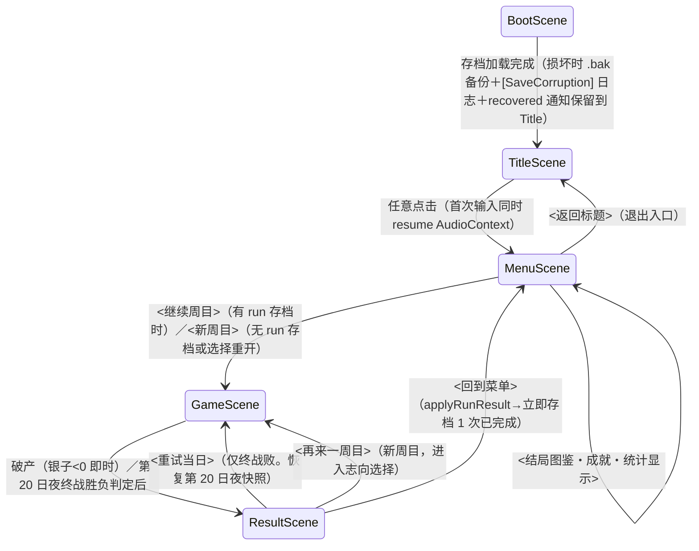

# GDD — 江湖客满

> 引擎: phaser（Phaser 3 + TypeScript + Vite，tech-stack.md 权威）。单画面经营养成，GameScene 内以「晨/日/夜」状态机推进一日，无场景跳跃。
> MDA 对应总纲: 三段回合结构/岗位分配/实时订单调度（Mechanics）→ 稀缺调度博弈・成长与营收拉锯・三线取舍（Dynamics）→ 一日呼吸感（P-01）・成长可视化成就感（P-02）・志向归属感（P-03）・单手顺手（P-04）。

## 系统一览

| 系统 | P-xx | 概要（输入→处理→输出） | 实现位置参考（systems/） |
|---|---|---|---|
| 一日相位控制器 | P-01 | 输入=相位推进操作（晨间「开门营业」→日间、夜间「天明」→次日晨间，见操作规格）＋当日完成条件（破产判定/第 20 日终战）；处理=晨→日→夜的状态机与相位间迁移；输出=当前相位与迁移事件。日间 `DAY_SERVICE_DURATION_S` 是唯一硬计时，晨间/夜间为无强制时限的回合相位（引导目标 `MORNING_GUIDE_TARGET_S`），单日 ≈6 分钟量级、无跨日悬置状态 | `dayCycle.ts`（纯状态机） |
| 岗位分配系统 | P-01/P-03 | 输入=点击岗位→点击伙计（两次点击）；处理=每伙计每日占 1 岗或待命（跑堂/掌柜/采购/修练，容量: 掌柜 ≤1、跑堂 0–5、采购 0–2、修练 ≤`TRAINING_SLOTS`；可不指派=待命）；输出=当日岗位表。修练与值班的取舍是晨间全部张力 | `assignment.ts` |
| 修练成长系统 | P-02 | 输入=修练指派；处理=指定属性 +1 并刷新成长阶段（3 档）；输出=属性值、成长阶段（驱动台词/动作/立绘差分）。成长必有可见表现差分 | `training.ts` |
| 客人流与订单系统 | P-01/P-04 | 输入=到达计时器+点击；处理=客人生成→点单→等菜→上菜→收钱的状态链，耐心倒计时；输出=银两/声望/满意度事件 | `customerFlow.ts`、`order.ts` |
| 后厨系统 | P-01 | 输入=点单；处理=按菜品准备时间制菜（耗时受手艺缩短，见「三属性的日间效果」）；输出=出餐口可取的菜。采购人数决定当日可选菜种（0/1/2 人 → 2/4/6 种 = `PURCHASE_KINDS_0/1/2`） | `kitchen.ts` |
| 经济系统 | P-03 | 输入=收入/工钱/事件 Δ；处理=银子・声望的加算（夜间结算扣除当日工钱 `DAILY_WAGE_PER_STAFF` × 在编 5 名）与破产判定；输出=三线数值（银子/声望/伙计实力） | `economy.ts` |
| 事件卡系统 | P-03 | 输入=夜间的「翻卡」点击；处理=从卡池抽 1 张、按志向偏移显示效果倾向、执行所选选项；输出=银子/声望/侠点/伙计状态变化 | `eventCard.ts` |
| 志向系统 | P-03 | 输入=开局志向选择；处理=设定初始资源、事件最优解偏移、结局判定权重；输出=志向参数包（贯穿 20 日） | `ambition.ts` |
| 终战系统 | P-02/P-03 | 输入=第 20 日夜开战确认；处理=3 回合自动战力对撞演出（伙计实力+银子援助 vs 敌战力）；输出=胜/败 | `finalBattle.ts` |
| 结局判定系统 | P-03 | 输入=终战胜负+三线达成度；处理=argmax(财/侠/名达成度)；输出=3 结局之一与总评分 | `ending.ts` |
| RunResult / 元进度 reducer | P-02/P-03 | 输入=周目结束时的 RunResult；处理=纯 reducer 计算最高分/统计/成就/解锁；输出=新 SaveData（接收值返回值，不做 I/O） | `meta/metaProgression.ts` |
| 中断续玩 | P-01 | 输入=日间夜间边界/手动中断；处理=按日快照序列化周目状态；输出=可恢复的 run 存档 | `runSnapshot.ts`（序列化为纯函数） |
| 点击输入模块 | P-04 | 输入=pointer down；处理=命中检测与优先级仲裁（单点即触发，无长按/拖拽）；输出=语义化点击事件（`onTableTap` 等） | `input/` |
| i18n 系统 | P-04 | 输入=key；处理=查当前语言表，缺 key 回落中文并 console.warn 1 次；输出=文案。brief 必须项（5 语言），以母语显示降低上手门槛支撑 P-04 | `i18n/` |

（持久化 I/O 全部封闭在 `src/persistence/`，元进度逻辑在 `src/systems/meta/` — tech-stack.md 规范 9。Scene 保持轻薄，上述系统均为不依赖 Phaser 的纯逻辑。）

## 游戏流程

周目内流程（GameScene 内部状态，非场景迁移）: 志向选择（新周目第 1 晨前）→ 晨间排班 → 日间实时接客 → 夜间结算+事件卡 →（第 20 日夜: 终战）→ 次日晨间。**志向选择确认时即写入 run 快照**（否则第 1 夜结算前中断时 SaveData.run 仍为 null、Menu 无「继续周目」、志向选择白做 — 违反 brief「可随时中断续玩」）。此后每夜结算后自动保存 run 快照（中断续玩，P-01）。中断粒度 = 1 日: 日间中断（帐本面板→回到菜单）视为放弃当日日间进度，恢复到当日晨间快照（设计判断: 快照按日 1 次即可，日间也写快照会倍增序列化时机与测试面，且与 P-01「以一日为单位消化」一致 — 已确认接受此体验落差）。相位迁移全部由玩家操作触发（晨间「开门营业」、夜间「天明」— 见操作规格）；晨间与夜间结算是无强制时限的回合相位，晨间引导目标 `MORNING_GUIDE_TARGET_S`=120s（超时仅「开门营业」按钮脉冲提示，不强制推进）。

### Menu 必需要素检查（contract §11）

| 必需要素 | 对应的迁移/显示（与上方 mermaid、实现一致） |
|---|---|
| 开始游戏 | 「继续周目」（run 存档存在时显示，跳转 GameScene 恢复到当日晨间）／「新周目」（跳转 GameScene 志向选择） |
| 游戏外显示（解锁/成就/统计） | 「结局图鉴・成就」面板（ACH-01～06、UNL 状态、3 结局一览）与「统计」面板（最高分/周目数/银子声望峰值），MenuScene 内点击展开 |
| 设置（音量、操作说明。音量接线到实际音频输出并持久化） | BGM 音量滑块（0–1，实时作用于 `sound.volume`）、SFX 音量滑块、语言选择（中/英/日/韩/泰）、操作说明面板；全部变更即写持久化存档 |
| 退出入口 | 「返回标题」按钮（→TitleScene） |

## 操作规格

前提: 输入集中到 1 个模块（tech-stack.md 规范 4）。全部为单次 pointer down 即触发（pointerup 不要求），无双击/长按/拖拽/键盘依赖。可点击判定区 ≥48px（`BUTTON_MIN_SIZE_PX`）。

| 输入 | 动作 | 补充（优先级等） |
|---|---|---|
| 点击（晨间）岗位图标→点击伙计头像 | 指派该伙计到该岗位 | 两次点击制（P-04 裁定: 否决拖拽）。已指派伙计再次被点击=取消指派 |
| 点击（晨间）「开门营业」 | 晨间→日间迁移，开始实时接客 | 排班未完成也可开门（未指派=待命）。晨间无强制计时，超过 `MORNING_GUIDE_TARGET_S` 后按钮脉冲提示 |
| 点击（日间）亮起点单气泡的空桌 | 派空闲跑堂前往点单 | 同一桌重复点击无效。多桌同时亮起时任意点击各自独立 |
| 点击（日间）出餐口亮起的菜 | 派空闲跑堂上菜 | |
| 点击（日间）吃完亮起银两气泡的桌 | 收钱（无掌柜时需手动；有掌柜时自动） | |
| 点击（夜间）事件卡选项 | 执行该选项效果 | 选项 2～3 个，纵向大按钮 |
| 点击（夜间）事件卡结果反馈的「天明」 | 结束夜间、进入次日晨间 | 不自动推进，保证玩家读完结果反馈。第 20 日夜该按钮为「迎战」→终战确认 |
| 点击（夜间）「翻卡」 | 抽取事件卡 | 夜间结算摘要面板显示后点击（每夜 1 张） |
| 点击（终战）「开战」／「雇镖师援助」 | 开始终战演出／花银两加战力后开战 | |
| 点击右上「帐本」按钮 | 打开暂停面板（继续／回到菜单） | 日间中也可用（计时暂停）。优先级最高，面板开启时屏蔽其他点击 |

同时命中多对象的优先级: 暂停面板 > 事件卡选项 > 出餐口 > 收钱气泡 > 点单桌（越接近「救火」的动作优先受理）。均由输入模块做命中排序，业务系统不感知实现细节。

## 敌人与障碍物

（本作无战斗型敌人；「障碍」= 客人压力与有限人手。终战大敌单列。）

| 类型 | 行为模式 | 碰到时（未及时服务） | 出现条件 | 对应资产 id（IMG-xx 于 assets.md 分配后回填） |
|---|---|---|---|---|
| 散客 | 进店→点 1 菜→等菜→吃→离店 | 耐心归零: 离店、声望 −2 | 全日，权重随日数递减 | 客人立绘_散客（IMG-xx 回填） |
| 镖师 | 点 2 菜，耐心 ×1.3 | 离店、声望 −3 | 第 4 日起，权重渐增 | 客人立绘_镖师（IMG-xx 回填） |
| 老饕 | 指定高级菜（4～6 号菜），耐心 ×0.8。**当日可选菜种 < 4（无 4 号以上菜）时不生成**（等待下一名普通客人，不占用到达间隔） | 离店、声望 −4 | 第 7 日起（与「难度曲线」表一致） | 客人立绘_老饕（IMG-xx 回填） |
| 江湖大敌（终战） | 第 20 日夜固定登场，3 回合自动战力对撞演出，无玩家实时操作 | 战败=败局（可重试当日） | 固定事件 | 终战大敌立绘（IMG-xx 回填） |

障碍性机制（同一节内说明）: 疲劳状态（部分事件卡结果）使次日该伙计动作耗时 ×`FATIGUE_PENALTY`（体力减免，见「三属性的日间效果」）；无采购（`PURCHASE_KINDS_0`=2）时当日仅 2 种菜可用、客人耐心 −10s。均为数值状态，无独立资产。

## 分数与进度

- **周目内进度单位**: 日（1→20）＋三线达成度（夜结算面板实时显示银子/声望/伙计实力合计）
- **收入**: 每单 = round(菜价 ×(1＋小费率)) 。小费率 = 剩余耐心比例 × `TIP_FACTOR`（上菜越快小费越高）。夜间结算扣除当日工钱（`DAILY_WAGE_PER_STAFF` × 在编 5 名 = 30 两/日，见数值表）
- **声望**: 每成功服务 +1（老饕 +2）；掌柜岗位 +1/日（容量 ≤1 名，多人指派不可、无叠加；见「岗位分配系统」容量定义）；服务失败按客人类型 −2～−4；事件卡 ±
- **总评分**（ResultScene 显示、计入最高分）:
  `score = floor(silverEnd × 0.5 ＋ repEnd × 10 ＋ staffPowerTotal × 20 ＋ endingBonus)`
  `endingBonus`: 财/名结局 = 200、侠结局 = 200（三结局同权，分差来自三线数值本身 — 支撑 P-03 的「数值如实兑现」）
- **三线贡献表**（`SCORE_W_*` 的量纲依据。典型游玩终值带 × 权重）:

| 线 | 典型终值 | 权重 | 贡献 |
|---|---|---|---|
| 财（silverEnd） | 350–650 两 | 2 | 700–1300 |
| 名（repEnd） | 60–130 | 10 | 600–1300 |
| 力（staffPowerTotal） | 29–49 | 20 | 580–980 |

  三线贡献同为千点量级 → 「三线等量级」成立。总评分使用**未封顶原值**（`ENDING_CAP` 只作用于结局判定，不影响分数）
- **总评分不含用时项（与 brief「胜负」节『用时』的已知名义差异）**: 本作为固定 20 日 × 三段回合制，用时主要由玩家的中断/现实生活节奏决定，而非玩法质量的信号；计入用时会惩罚 brief 目标用户（碎片时间、可随时中断续玩的玩家）。因此「最佳时间」记录轴不适用（见元进度），元进度仅记最高分。此偏差如需人工裁定，提交 Checkpoint A 确认
- **单日成绩摘要**（夜结算）: 当日收入、声望净变、服务成功/失败数 — 只展示不另计分

## 难度曲线

以「日间 3 分钟内可读完、单日 ≈6 分钟」为约束（P-01 裁定线）。口径: 日间 `DAY_SERVICE_DURATION_S`=180s 是**唯一硬计时**；晨间（引导目标 `MORNING_GUIDE_TARGET_S`=120s）与夜间结算/事件卡（引导目标 ≈60s）为无强制时限的回合相位、依赖玩家自行推进，按引导目标计入口径 180＋120＋60 ≈ 6 分钟。到达间隔与基础耐心均为**阶段常量**（数值表 `CUSTOMER_INTERVAL_D*_S` / `CUSTOMER_PATIENCE_D*_S`），本表与数值表一一对应、不使用插值式（config.ts 权威来源唯一）。

| 日 | 客人到达间隔 | 基础耐心 | 变化内容 |
|---|---|---|---|
| 1–3 | 12s（`CUSTOMER_INTERVAL_D1_3_S`） | 50s（`CUSTOMER_PATIENCE_D1_3_S`） | 教学节奏: 仅散客、菜品池 ≤3 种（= min(`PURCHASE_KINDS_x`, `TEACHING_DISH_CAP`=3)，见数值表）、首日带操作引导 |
| 4–9 | 10s（`CUSTOMER_INTERVAL_D4_9_S`） | 45s（`CUSTOMER_PATIENCE_D4_9_S`） | 镖师登场、老饕第 7 日起登场（同段后半）、菜品池全 6 种（教学上限解除）、开始出现双客同时 |
| 10–15 | 8s（`CUSTOMER_INTERVAL_D10_15_S`） | 40s（`CUSTOMER_PATIENCE_D10_15_S`） | 老饕权重渐增、大单（高级菜）比例上升 |
| 16–19 | 7s（`CUSTOMER_INTERVAL_D16_20_S`） | 35s（`CUSTOMER_PATIENCE_D16_20_S`） | 高峰期: 3 客同店常态化，检验养成成果 |
| 20 | 7s（沿用 D16_20） | 35s（沿用 D16_20） | 日间照常 → 夜间终战 |

修练投入使「日间更难看」（跑堂减少）与「动作更快」对冲，形成玩家自定的曲线（Dynamics: 成长与营收的拉锯 → P-02）。

## 数值表

实现时全部抄写为 `src/config.ts` 常量（tech-stack.md 规范 1）。

| 常量名 | 含义 | 初始值 | 调整范围 | 依据 |
|---|---|---|---|---|
| DAY_SERVICE_DURATION_S | 日间实时段时长（全游戏唯一硬计时） | 180 s | 150–210 | brief: 日间约 3 分（P-01） |
| MORNING_GUIDE_TARGET_S | 晨间排班的引导目标（非强制计时；超时仅「开门营业」按钮脉冲提示） | 120 s | 90–180 | P-01 晨间约 2 分。晨间无强制时限，单日 ≈6 分钟按此引导口径成立（见难度曲线） |
| CUSTOMER_INTERVAL_D1_3_S / D4_9_S / D10_15_S / D16_20_S | 各阶段客人到达间隔（第 20 日日间沿用 D16_20） | 12 / 10 / 8 / 7 s | 10–14 / 8–12 / 7–10 / 6–9 | 难度曲线表的阶段常量（无插值，一一对应） |
| CUSTOMER_PATIENCE_D1_3_S / D4_9_S / D10_15_S / D16_20_S | 各阶段散客基础耐心（第 20 日日间沿用 D16_20） | 50 / 45 / 40 / 35 s | 40–60 / 36–55 / 32–50 / 28–45 | 难度曲线表的阶段常量；镖师 ×1.3、老饕 ×0.8、无采购 −10s 在此基础上修正 |
| STAFF_MOVE_SPEED | 跑堂移动速度基准 | 220 px/s | 180–280 | 横穿大厅约 3 秒 |
| ORDER_TAKE_S | 点单动作耗时 | 3 s | 2–4 | 与耐心 45s 的比例约 1:15 |
| SERVE_S | 上菜动作耗时 | 2 s | 1.5–3 | 短于点单，节奏重音在移动 |
| STAFF_SPEED_FACTOR | 每 1 点速度的动作耗时缩短率 | 0.15 | 0.10–0.25 | 速度 5 点≈耗时减半，肉眼可感（P-02） |
| TRAINING_GAIN | 每次修练属性增量 | 1 | 1–2 | 线性成长便于预判终战力 |
| STAFF_STAT_MAX | 单属性上限 | 10 | 8–12 | 20 日 ×2 槽不足以全满，保留取舍 |
| TRAINING_SLOTS | 每日修练位 | 2 | 1–3 | 5 人 4 岗稀缺博弈的核心配速 |
| DISH_PREP_BASE_S | 1 号菜制菜耗时。`DISH_PREP(n) = DISH_PREP_BASE_S + (n−1) × DISH_PREP_STEP_S` | 6 s | 4–8 | 6 号菜 = 6 + 5×1.6 = 14 s（10–16），按菜号线性递增 |
| DISH_PREP_STEP_S | 每菜号递增的制菜耗时 | 1.6 s | 1.2–2.0 | 高级菜更慢的调度压力来源 |
| DISH_PRICE_MIN / MAX | 菜价下限/上限。菜号 n 价格 = `MIN + (n−1) × (MAX−MIN)/5`（= 菜号两数） | 1 / 6 两 | 1–2 / 5–8 | 1–6 号菜 = 1 / 2 / 3 / 4 / 5 / 6 两。量纲基准: 与客流量（≈15–26 客/日）、DAY_INCOME_TARGET≈50、财线算式（SILVER_GOAL=300）相互咬合 |
| PURCHASE_KINDS_0 / 1 / 2 | 采购岗位 0/1/2 人时的当日可选菜种数（菜号 1 起） | 2 / 4 / 6 种 | 2 / 3–4 / 5–6 | 采购岗位收益的可读映射；无采购时客人耐心 −10s（障碍性机制） |
| TEACHING_DISH_CAP | 第 1–3 日教学期的可选菜种上限（实际 = min(PURCHASE_KINDS_x, TEACHING_DISH_CAP)；第 4 日起解除） | 3 种 | 2–4 | 教学期不出现 4 号以上菜，与老饕「<4 种不生成」规则叠加后教学期必无老饕 |
| DAY_INCOME_TARGET | 第 5 日单日收入目标 | 50 两 | 40–70 | 第 5 日 ≈ 18 客 × 成功率 0.75 × 均价 3.5 两 × 小费 1.1 ≈ 52 两（见胜负条件「财线可行性算式」）；银子曲线在 20 日内不触破产线的基准 |
| DAILY_WAGE_PER_STAFF | 每名在编伙计的每日工钱（夜间结算扣除，5 名 = 30 两/日）。**brief 外的追加**: 经济系统的日常成本项，使破产线与 P-03 财线「抠成本」的取舍成立 | 6 两 | 4–8 | 第 5 日净收入 ≈ 52−30 = +22 两/日；侠线开局 60 两可承受约 2 次负 Δ 事件卡 → 破产威胁真实但不泛滥 |
| TIP_FACTOR | 小费率上限 | 0.2 | 0.1–0.3 | 快速服务的即时奖励 |
| SILVER_START | 初始银子 财/侠/名 | 150/60/90 两 | ±30 | P-03: 财线起步富余、侠线起步薄 |
| REP_START | 初始声望 财/侠/名 | 15/30/40 | ±10 | P-03: 名线以声望起手 |
| AMBITION_BIAS | 志向对事件效果偏移率 | 0.3 | 0.2–0.4 | 同一选项在适配志向下收益 +30%（P-03 分化最小实现） |
| ENEMY_POWER | 终战大敌战力 | 32 | 26–40 | 悬念带设计（三档算式见「胜负条件」）: 修练 +2～+6 进入比赛胜率 0.35–0.85 的险胜带；无修练 ≈0.13（靠援助/重试）；半数修练 49 → 必胜＝投入兑现（BATTLE_VARIANCE 不逆转养成差距的正面表述）。旧依据文「修练约半数可胜」作废 |
| BATTLE_ROUNDS | 终战回合数 | 3 | 3–5 | 2 胜即胜，演出约 40 s |
| BATTLE_VARIANCE | 单回合战力随机波动 | 0.15 | 0.1–0.2 | 有悬念但不逆转养成差距 |
| BATTLE_AID_COST / AID_POWER | 雇镖师援助费用/战力 | 100 两 / 8 | 80–120 / 6–10 | P-03: 财线以银子补战力的通道 |
| SILVER_GOAL / XIA_GOAL / REP_GOAL | 结局判定达成线 财/侠/名 | 300 两 / 侠点 32 / 声望 80 | 200–400 / 26–40 / 70–90 | argmax 判定的分母（见胜负条件的财/侠/名三线可行性算式） |
| ENDING_CAP | 结局判定的单线达成度封顶（**仅施加于财/名**；侠点无被动来源、不封顶） | 1.2 | 1.1–1.5 | 财/名的被动累积典型可达 1.4–2×，会压过侠线上限 ≈1.23×、使 argmax 恒偏向被动线。封顶后多线同时触顶成为常态、由志向决胜（P-03）。总评分使用未封顶原值 |
| XIA_POINT_PER_CHOICE | 侠系事件选项的侠点 | 3 | 2–5 | 15 卡中 8 卡含侠选项（#1/2/3/6/7/11/13/15 → 每夜出现概率 ≈0.53） |
| FATIGUE_PENALTY | 疲劳状态的次日动作耗时倍率（体力 0 时） | 1.2 | 1.15–1.3 | 部分事件卡结果；体力减免见「三属性的日间效果」 |
| CRAFT_KITCHEN_FACTOR | 每 1 点手艺的制菜耗时缩短率 | 0.10 | 0.06–0.15 | 手艺的日间效果（P-02）— 见「三属性的日间效果」 |
| CRAFT_KITCHEN_CAP | 制菜缩短率上限 | 0.60 | 0.50–0.70 | 防止高属性把制菜时间归零 |
| STAMINA_RESIST | 每 1 点体力的疲劳耗时增幅减免率 | 0.05 | 0.03–0.08 | 体力的日间效果（P-02）— 见「三属性的日间效果」 |
| SCORE_W_SILVER / REP / POWER | 总评分权重 | 2 / 10 / 20 | 1.5–3 / ±30% / ±30% | 三线贡献表（见「分数与进度」）: 典型终值下三线同为千点量级（财 700–1300 / 名 600–1300 / 力 580–980）。旧权重 0.5 使财线贡献仅为其他线的 1/4～1/6，与「三线等量级」矛盾，故校正为 2 |
| BGM_VOLUME / SFX_VOLUME | 默认音量 | 0.7 / 0.8 | 0–1 | 设置项，持久化 |
| BUTTON_MIN_SIZE_PX | 最小可点击判定 | 48 px | 48–64 | brief 触控要求（P-04） |

### 三属性的日间效果（P-02: 修练后日间可见差异）

三属性**全部同时**具有日间效果与终战战力贡献（`playerPower = Σ(速+艺+体)` 不变）:

- **速度**: 点单/上菜/收钱动作耗时 × (1 − `STAFF_SPEED_FACTOR` × 速度)（既有，0.15）
- **手艺**: 制菜耗时 × (1 − min(`CRAFT_KITCHEN_CAP`, `CRAFT_KITCHEN_FACTOR` × 掌勺手艺))。**掌勺手艺 = 当日店内（岗位≠修练）伙计中手艺最高者的手艺值** — 修练中的伙计不在灶前，其手艺不计入。铁牛（艺 3）在灶 → 6 号菜 14s → 9.8s；修练铁牛至艺 10 → 缩短 60% 封顶。裁定依据: 选「最高手艺=掌勺」而非「合计手艺」— 使「修练厨子」与「把厨子派去跑堂」形成与修练/值班同构的取舍，且公式对玩家可解释（谁手艺最高谁掌勺）
- **体力**: 疲劳状态的次日动作耗时倍率 = 1 + (`FATIGUE_PENALTY` − 1) × (1 − `STAMINA_RESIST` × 体力)。体力 4 的大嵩 → ×1.16、体力 10 → ×1.1（高体力近乎免疫疲劳）；无疲劳时体力无日间效果、仅计入终战

（终战胜负仍以三属性合计战力判定 — 日间效果是 P-02 可见差异的载体，不改变终战量纲。）

伙计初始值（5 名、每人 速度/手艺/体力，成长阶段=3 档按属性合计 0–6/7–13/14+ 划分）:

| 伙计 | 速 | 艺 | 体 | 性格与可见差分（P-02） |
|---|---|---|---|---|
| 阿福（小二） | 3 | 1 | 2 | 起步摔盘子；高阶后跑位带残影提示与得意台词 |
| 铁牛（厨子） | 1 | 3 | 2 | 低位制菜冒黑烟；高阶出菜带金光特效 |
| 文曲（账房） | 2 | 2 | 1 | 收钱动作从数错钱到拨算盘如飞 |
| 小蝶（杂役） | 2 | 1 | 3 | 低位走路同手同脚；高阶步伐轻快 |
| 大嵩（护院） | 1 | 1 | 4 | 终战主力；台词从「我只会挡」到「交给我」 |

差分实现: 同一张基础立绘上的程序化差分（色调/表情贴片/缩放）＋速度/动作参数变化＋台词库阶段切换。不新增整张立绘资产（brief 图像上限）。

事件卡 15 张（每卡导语 1＋选项 2–3＋结果反馈 1；主要影响线标注 P-03 分化轴）:

| # | 标题 | 主要影响 | # | 标题 | 主要影响 |
|---|---|---|---|---|---|
| 1 | 镖师借宿 | 银/侠点 | 9 | 盗匪传闻 | 银/声望 |
| 2 | 官差查夜 | 声望/侠点 | 10 | 婚礼包席 | 银 |
| 3 | 乞丐赠曲 | 侠点/声望 | 11 | 老友来访 | 侠点/伙计状态 |
| 4 | 泼皮闹事 | 声望/银 | 12 | 药材商推销 | 银/伙计状态 |
| 5 | 同行拆台 | 声望 | 13 | 义庄夜惊 | 声望/侠点 |
| 6 | 书生赶考 | 侠点/名 | 14 | 酒鬼闹账 | 银/声望 |
| 7 | 饥荒施粥 | 侠点/银 | 15 | 比武招徒 | 伙计实力/侠点 |
| 8 | 商队歇脚 | 银 | | | |

效果幅度模板: 银子 Δ −25～+15 两（量纲依据: 日净收入 ≈ +22 两、侠线开局 60 两 — 旧幅度 −40～+30 相对工钱导入后的经济量纲过重，一次负 Δ 即近半月净收）、声望 Δ −10～+10、侠点 0～5、伙计疲劳（次日耗时 ×1.2）概率 ≤20%。每选项叠加 `AMBITION_BIAS` 偏移。

## 胜负条件

- **失败（即时）**: `silver < 0` 的瞬间 → 败局演出（账本合上）→ ResultScene（败局文）。不可重试（周目已成立，重来即新周目）
- **终战（第 20 日夜）**: 开战前可选择雇镖师援助（−100 两/+8 战力）。3 回合各按 `playerPower/3 ×(1±0.15)` vs `enemyPower/3 ×(1±0.15)` 对撞，先取 2 回合胜者胜
  - `playerPower = Σ(全伙计 速度+手艺+体力) ＋ 援助加成`
  - **终战三档胜率算式**（ENEMY_POWER=32 的依据。`playerPower/3 ×(1±0.15)` vs `enemyPower/3 ×(1±0.15)` 的均匀波动下）:
    - 无修练 playerPower=29: 回合胜率 ≈0.23 → 比赛胜率 ≈0.13（实质必败 → 靠援助或重试）。+援助 8 → 37: 回合 ≈0.86 → 比赛 ≈0.95（财线银子通道可翻盘，P-03）
    - 少量修练 +2～+6（playerPower 31–35）: 比赛 ≈0.35–0.85 → **险胜带**（约前半周目的自然修练投入落入此带）
    - 半数修练 +20（49）: 玩家最坏回合 13.9 > 敌方最好回合 12.3 → 比赛必胜＝投入兑现（悬念由 20 日经营承担；BATTLE_VARIANCE「不逆转养成差距」的正面表述）
  - **终战胜利** → 结局判定: `达成度_财 = min(silverEnd/300, ENDING_CAP)`、`达成度_侠 = xiaPoints/32`（不封顶 — 侠点无被动来源，上限即抉择纪律的体现）、`达成度_名 = min(repEnd/80, ENDING_CAP)`。取达成度最高者为其结局；**复数线同为封顶值时以开局志向线优先**；无一线 ≥1.0 时仍取最高者，结局文标注「险成」→ ResultScene（结局文＋总评分）
    - 封顶＋志向决胜的理由: 财/名存在被动累积（正常经营即可达 1.4–2×），不封顶则 argmax 恒偏向被动线、志向选择失去结局意义。封顶后多线同时触顶成为常态、由志向决胜；**被忽略的线才是未触顶的线**（例: 侠志向却全不选侠选项 → 侠 ≈0.95 <1.0、名触顶 → 名结局 = 志向未贯彻的后果兑现，P-03）
  - **终战失败** → ResultScene 提供「重试当日」（恢复第 20 日夜开战前快照，银子/声望回到快照值）或「回到菜单」

**侠线可行性算式**（XIA_GOAL=32 的依据）: 15 张事件卡中 8 张含侠选项（#1/2/3/6/7/11/13/15）→ 每夜抽到含侠选项卡的概率 ≈ 8/15 ≈ 0.53，19 个事件夜 ≈ **10.1 次侠选项机会**。

- 侠志向＋全选侠选项: 10.1 × `XIA_POINT_PER_CHOICE`(3) × `AMBITION_BIAS`(1.3) ≈ **39.4 点 ≥ 32**（达成率 ≈ 1.23×）→ 完美偏侠游玩可达约定 1.0～1.2 倍
- 非侠志向（无偏移）全选侠: 10.1 × 3 ≈ 30.3 < 32 → 侠结局实质上要求侠志向开局（或额外侠点来源的事件选择）— 这正是 P-03「志向贯穿」的体现，非缺陷
- 无尽型不适用（本作固定 20 日周目制）

**财线可行性算式**（SILVER_GOAL=300 的依据，与侠线同型的供给侧算式）: 全周目到达客 ≈415 名（阶段间隔常量合计 ≈ 15×3＋18×6＋22×6＋26×5，老饕生成条件使实际略减）、每单均收入 ≈ 均价 3.5 两 × 小费 1.1 ≈ 3.85 两 → 总收入 ≈ 415 × 服务成功率 × 3.85。

- 典型成功率 0.75: 总收入 ≈1200 两 − 总工钱 600（30 两 × 20 日）− 事件卡净 ≈ −76（19 夜 × 均值 −4 两）→ silverEnd ≈ 510–620（含 SILVER_START 90–150）→ 达成度 ≈1.7–2.1 → 封顶 1.2
- 达成门槛 300 两 ⟺ 总收入 ≈786 两 ⟺ 全周目平均成功率 ≈0.5 — 三线中最宽的门槛（P-03: 财线以量取胜、SILVER_START 150 起步富余）；雇援助（−100 两）与达成线构成财线自身的取舍
- 破产线由工钱维持真实: 侠线开局 60 两、日净 ≈ +22 两，连续 2 次负 Δ 事件卡即进入危险区

**名线可行性算式**（REP_GOAL=80 的依据，与侠线同型）: 每名到达客的声望净收支 = 成功 +1.1（老饕 +2、权重 ≈10%）− 失败 −3（均值）= `4.1s − 3`（s = 服务成功率）。

- 收支平衡点 s* = 3/4.1 ≈ **0.73**（低于此声望净流失 — 失败惩罚重正是名线的核心杠杆）
- repEnd = REP_START(名 40) ＋ 415 × (4.1s − 3) ＋ 掌柜 +20 → REP_GOAL=80 ⟺ 全周目平均成功率 ≈**0.74**；典型带 s = 0.74–0.78 → repEnd ≈ 80–140 → 达成度 1.0–1.75（封顶 1.2）
- 敏感性: 成功率每 +0.01 ≈ +17 声望 → 「维持稳定服务」正是名线的玩法身份；REP_START 40 ＋ 掌柜常驻 +20 ＋ 事件的 `AMBITION_BIAS` 偏移提供名线志向的缓冲

## 重新开始

- **终战败重试**: ResultScene「重试当日」1 次点击 → GameScene 第 20 日夜（恢复快照: 银子/声望/侠点/伙计状态/开战前选择）。快照在第 20 日夜结算完成时生成
- **新周目**: ResultScene「再来一周目」→ GameScene 志向选择（不继承任何周目内状态；仅继承元进度: 最高分/统计/成就/解锁/设置）
- **Menu 重开**: MenuScene「新周目」随时可用（放弃当前 run，run 存档被新志向选择覆盖前弹确认面板）
- 状态泄漏检查项: 重开时计时器、客人实体、岗位表、事件卡弃牌堆全部重置；`recovered` 标志与音量/语言设置跨周目保留
- **日间中断**（帐本面板→回到菜单）: 恢复到当日晨间快照，当日日间进度放弃（中断粒度 = 1 日，见「游戏流程」）

## 元进度（游戏外）

实现: 逻辑=`src/systems/meta/`（不依赖 Phaser），持久化 I/O=`src/persistence/`（唯一 `localStorage` 引用处，键 `arcaderelay-save`，首字段 `save_version`）。损坏协议（.bak 备份＋`[SaveCorruption]` 日志 1 次＋默认值重建＋`recovered` 传播到 Title/Menu）遵循 contract §6 / tech-stack.md。

### 采用要素

| 要素 | 采用（必需/可选-采用/可选-非采用） | P-xx | 依据（1句） |
|---|---|---|---|
| 最高分 / 最佳时间 | 必需 | P-03 | 总评分是三线兑现的单一数字化 |
| 统计 | 必需 | P-02/P-03 | 峰值与周目数让「调教成果」跨周目可见 |
| 货币 | 可选-非采用 | — | 银子已是局内资源，元进度货币无消费去向、不独立成立 |
| 解锁 | 可选-采用 | P-02/P-03 | 多结局图鉴驱动「再来一周目」，解锁新初始伙计直接服务养成爽点 |
| 成就 | 可选-采用 | P-03 | 结局图鉴即成就，志向分差的收集动机 |
| 跨局升级 | 可选-非采用 | — | 违反 P-03（不放大志向分差的要素不进）且超范围约束 |

### 最高分 / 最佳时间

| 记录轴 | 汇总方法 | 显示目标场景 |
|---|---|---|
| 最高总评分 | 历史周目 score 最大值 | Menu 统计面板、ResultScene（新纪录标记） |
| 最佳时间 | **不适用** — 固定 20 日周目制、无时间轴（理由与 brief 偏差记录见「分数与进度」） | — |

### 统计

| 统计项目 | 更新时机 | 显示位置 |
|---|---|---|
| 周目数（finished_runs） | applyRunResult 时 +1 | Menu 统计面板 |
| 银子峰值（全局） | max(历史 silverEnd) | Menu 统计面板 |
| 声望峰值（全局） | max(历史 repEnd) | Menu 统计面板 |
| 结局一览（endings_seen[3]） | 达成对应结局时置位 | Menu 结局图鉴面板 |
| 累计服务成功客数 | 夜结算累加 | Menu 统计面板 |

### 解锁（仅采用时）

| ID (UNL-xx) | 对象类型 | 解锁条件（判定式、阈值并记调整范围） | P-xx |
|---|---|---|---|
| UNL-01 | 新初始伙计「柳镖头」（速 2/艺 1/体 4，可替换编成中任意 1 名默认伙计开局） | 达成任意 1 个结局（endings_seen 计数 ≥ 1（1–2）） | P-02 |
| UNL-02 | 新初始伙计「苏御厨」（速 1/艺 4/体 1） | 达成 2 种以上结局（endings_seen 计数 ≥ 2（2–3）） | P-02 |

（解锁=仅解放标志位＋伙计选择界面可选，实现成本最小；立绘计入 brief 的 30 图上限内。）

### 成就（仅采用时）

| ID (ACH-xx) | 条件（判定式、阈值并记调整范围） | 是否需要进度显示 | P-xx |
|---|---|---|---|
| ACH-01 | 达成财结局（ending == 财） | 否（图鉴点亮即显示） | P-03 |
| ACH-02 | 达成侠结局（ending == 侠） | 否 | P-03 |
| ACH-03 | 达成名结局（ending == 名） | 否 | P-03 |
| ACH-04 | 全结局图鉴完成（ACH-01∧02∧03） | 是（图鉴 3 格） | P-03 |
| ACH-05 | 单周目声望 ≥ 80（70–90，与 REP_GOAL 联动调整） | 否 | P-03 |
| ACH-06 | 单属性修练至上限（任一伙计任一属性 ≥ STAFF_STAT_MAX=10（8–12）） | 是（该属性进度条） | P-02 |

（成就=仅判定式，无奖励回路，实现成本最小。）

### 存档数据方针

损坏时行为遵循引擎通用规格（contract §6），此处仅列本游戏特有对象键与首次启动初始状态:

| 保存对象 | SaveData 字段名 | 初始值（首次启动时） |
|---|---|---|
| 存档版本 | save_version | 1 |
| 最高分 | best_score | 0 |
| 统计 | stats: {finished_runs: 0, silver_peak: 0, rep_peak: 0, served_total: 0} | 全 0 |
| 结局图鉴 | endings_seen: [false, false, false] | 全 false |
| 成就 | achievements: {ACH-01…ACH-06: false} | 全 false |
| 解锁 | unlocks: {UNL-01: false, UNL-02: false} | 全 false |
| 周目续玩快照 | run: null（无进行中周目；保存日数/银子/声望/侠点/伙计表/弃牌堆） | null |
| 设置 | settings: {bgm_volume: 0.7, sfx_volume: 0.8, lang: "zh"} | 上表值（zh=中文默认） |
| 恢复标志 | recovered | false（仅损坏恢复会话中为 true） |

保存时机: **志向选择确认时**（run 快照首次写入，覆盖「新周目」前的旧 run）、夜结算后（run 快照）、**周目终结时**（applyRunResult → 立即 persist 1 次）、设置变更时。连续重开不重复保存。

**run 快照的清除时机**: `applyRunResult` 执行时 `SaveData.run := null`（周目终结，Menu 不再显示「继续周目」）。applyRunResult 的执行时机:

- 破产即时败局 → ResultScene 进入时立即执行（无重试）
- 终战胜 → ResultScene 进入时立即执行
- **终战败 → ResultScene 进入时不执行**（run 快照保留到重试抉择后）: 选「重试当日」→ run 保留、继续周目；选「回到菜单／再来一周目」→ 执行 applyRunResult 并 `run := null`

（此规则防止破产/终战败后 Menu 残留「继续周目」并恢复已死周目。）

## 登场实体一览（供 assets.md / stories 推导）

| 实体 | 生成图像数 | 行为要点 | 资产类别 |
|---|---|---|---|
| 客栈大厅背景（俯视） | 1 | 晨/日/夜光照程序化变化 | 背景 |
| 伙计立绘（阿福/铁牛/文曲/小蝶/大嵩＋UNL-01/02 的 2 名） | 7 | **头像=立绘程序化裁切，不生成、计数 0**。成长差分为程序化（不新增立绘） | 立绘 |
| 客人立绘（散客/镖师/老饕） | 3 | 头像同上（程序化裁切，计数 0） | 立绘 |
| 江湖大敌 | 1 | 终战演出立绘 | 立绘 |
| 菜品图标 | 6 | 点单气泡/出餐口 | 图标 |
| 桌子图块 | 1 | 同一图块程序化摆放 6 桌＋程序化高亮（图块复用，计数 1） | 图块 |
| 志向图标（财/侠/名） | 3 | — | UI |
| 事件卡框 | 1 | 15 卡共用框 | UI |
| 结局插画 | 3 | 财/侠/名各 1 | 插画 |
| 标题 logo | 1 | — | UI |
| 共通 UI sheet | 1 | 按钮/面板底/帐本图标/资源图标（银两·声望·侠点）并入**单张 sheet**，程序化切分 | UI |

**合计算式**: 1＋7＋3＋1＋6＋1＋3＋1＋3＋1＋1 = **28 图（≤30 上限，余量 2）**。头像、成长差分、桌子摆放/高亮均为程序化，不占用生成数。SFX 8 / BGM 2 按 brief 音频方向。
